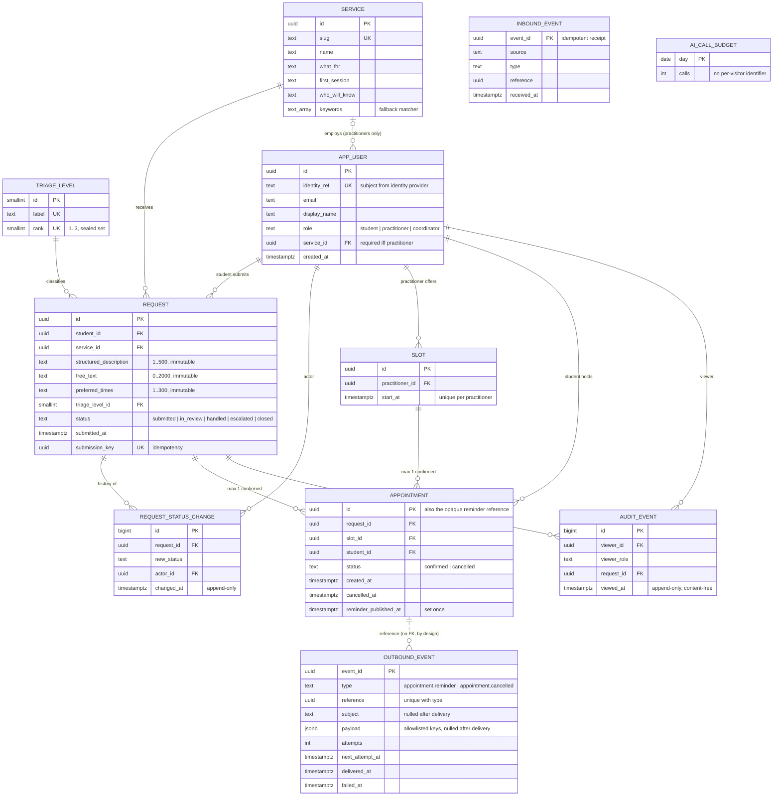
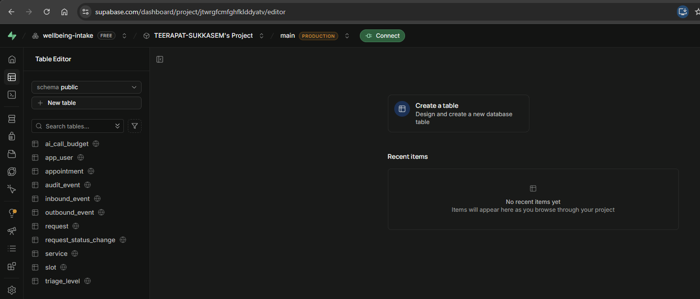

# A3 — Data and Query Design

**Team 16 · Private Wellbeing Intake & Booking** (Pod 4, Student Support — University Digital Campus Platform)

### Team members

| No. | Student ID | Name               |
| :-: | :--------: | ------------------ |
|  1  | 6731503011 | Dechawat Wetprasit |
|  2  | 6731503014 | Thiraphot Punkham  |
|  3  | 6731503015 | Teerapat Sukkasem  |
|  4  | 6731503018 | Nithanthip Kulmong |
|  5  | 6731503019 | Nithikorn Suttanu  |

### Project

|                   |                                                                                 |
| ----------------- | ------------------------------------------------------------------------------- |
| Repository        | <https://github.com/TEERAPAT-SUKKASEM/wellbeing-intake>                         |
| Database          | **Supabase** (managed PostgreSQL 17)                                            |
| Schema source     | [`supabase/migrations/`](../supabase/migrations) — two versioned SQL migrations |
| API contract      | [`openapi.yaml`](../openapi.yaml) — OpenAPI 3.1, 21 operations under `/api/v1`  |
| Examples captured | 2026-09-20, from the running application against seeded **demo data only**      |

> All data in this document is fictional seed data. No real student record exists anywhere in the
> project (PRD C-11, BR-18).

---

## 1. What the database has to do

Students privately request a campus health, counselling or wellbeing service, receive safe urgency
guidance, and book a confirmed time slot. The data is sensitive, so the database design is driven by
four requirements rather than by screens:

1. **Privacy** — request content is visible only to the student who wrote it and to practitioners of
   the one service it was sent to. Every such view is audited.
2. **Integrity under concurrency** — two students can never hold the same slot, even if they click at
   the same millisecond.
3. **Immutability** — what a student submitted can never be edited afterwards; history tables are
   append-only.
4. **Reliable messaging** — reminder events to the Notification Hub (Team 20) must never be lost and
   must never carry sensitive content.

## 2. Why we chose Supabase

We compared the three permitted options against those requirements.

| Requirement                                                                                                           | Cloudflare D1 (SQLite)                                                                                                         | Firebase Firestore (NoSQL)                     | **Supabase (PostgreSQL)**                                                           |
| --------------------------------------------------------------------------------------------------------------------- | ------------------------------------------------------------------------------------------------------------------------------ | ---------------------------------------------- | ----------------------------------------------------------------------------------- |
| Relational model with foreign keys (a booking links student ↔ request ↔ slot)                                         | Yes                                                                                                                            | No — references are unenforced strings         | **Yes**                                                                             |
| "One confirmed appointment per slot" enforced by the database                                                         | Yes — partial unique index                                                                                                     | No unique constraints at all                   | **Yes — partial unique index** decides the race                                     |
| Multi-step atomic operations with logic in between (check ownership → check status → insert → update → write history) | Batches only: no interactive transactions, no stored procedures, no row locks — checks and writes cannot share one transaction | Client-side transactions with retries          | **PL/pgSQL functions** with `SELECT … FOR UPDATE` — one transaction, one round trip |
| Immutability and append-only tables                                                                                   | Yes — triggers with `RAISE(ABORT)`                                                                                             | Security rules only, bypassed by the admin SDK | **Yes — triggers** that reject `UPDATE`/`DELETE`                                    |
| Defence in depth if an API bug exposes a key                                                                          | None — no row-level security                                                                                                   | Security rules                                 | **Row Level Security, deny-all**                                                    |
| Built-in authentication for the demo identity mode                                                                    | No                                                                                                                             | Yes                                            | **Yes** (Supabase Auth)                                                             |
| Cost                                                                                                                  | Free tier                                                                                                                      | Free tier                                      | **Free tier, no card** (PRD C-04: 0 THB)                                            |
| Local development that matches production                                                                             | Partial (Miniflare)                                                                                                            | Emulator differs from prod                     | **Identical Postgres in Docker** — CI runs the real migrations                      |

**Decision: Supabase.** Our hardest rules — _no double booking_, _content is frozen at submission_,
_every content view leaves an audit row in the same transaction as the read_ — are **database
invariants**, not application conventions. PostgreSQL lets us state them once, in SQL, where no code
path can bypass them. Firestore cannot express a unique constraint or a foreign key. D1 (SQLite) was
the closest alternative — it has foreign keys, partial unique indexes and triggers — but it has no
stored procedures, no row locks and no row-level security, so our check-then-write operations could
not run inside a single transaction and there would be no backstop behind the API. Supabase also gives us the same engine locally, in CI, and in
the cloud, so the migration we test is exactly the migration we deploy.

**How we use it (and how we deliberately do not):** the browser holds **no database credential**.
RLS is enabled on every table with **zero policies** and all grants to the `anon`/`authenticated`
roles are revoked, so the public key can read nothing. The only data path is our Next.js API
(`/api/v1/*`), which uses the service-role key on the server.

```
Browser ──HTTPS──▶ Next.js Route Handlers (/api/v1/*) ──service role──▶ Supabase Postgres
   (no DB key)        auth · role check · validation                     deny-all RLS · triggers ·
                                                                          unique indexes · PL/pgSQL
```

## 3. ER diagram



`INBOUND_EVENT` and `AI_CALL_BUDGET` are operational tables with no relationships. `OUTBOUND_EVENT`
is deliberately foreign-key-free: it is a transactional outbox whose rows must outlive, and reveal
nothing about, the records they refer to.

## 4. Database schema

Full DDL: [`20260920000001_schema.sql`](../supabase/migrations/20260920000001_schema.sql) (tables,
indexes, triggers, RLS) and [`20260920000002_functions.sql`](../supabase/migrations/20260920000002_functions.sql)
(13 transactional functions).

### 4.1 Tables

| Table                   | Purpose                             | Key constraints                                                                                                            |
| ----------------------- | ----------------------------------- | -------------------------------------------------------------------------------------------------------------------------- |
| `triage_level`          | The three fixed urgency levels      | **Sealed**: a trigger rejects every `INSERT`/`UPDATE`/`DELETE` after seeding                                               |
| `service`               | Public service catalogue            | `slug` unique                                                                                                              |
| `app_user`              | Minimal user record (5 fields + FK) | `identity_ref` unique; `role` check; `CHECK ((role = 'practitioner') = (service_id IS NOT NULL))`                          |
| `request`               | A student's private request         | Length checks; `status` check; `submission_key` unique (a double-click creates one request); **immutable-content trigger** |
| `request_status_change` | Who changed status, when            | **Append-only** trigger                                                                                                    |
| `slot`                  | A practitioner's offered time       | `UNIQUE (practitioner_id, start_at)`; "open" is derived, never stored                                                      |
| `appointment`           | A booking                           | **Two partial unique indexes** (below)                                                                                     |
| `audit_event`           | One row per content view            | **Append-only**; holds no content                                                                                          |
| `outbound_event`        | Transactional outbox to Team 20     | `UNIQUE (reference, type)`; `CHECK` allowlisting payload keys                                                              |
| `inbound_event`         | Delivery receipts from Team 20      | Primary key on `event_id` makes retries idempotent                                                                         |
| `ai_call_budget`        | Daily cap for the AI helper         | One row per day                                                                                                            |

All foreign keys are `ON DELETE RESTRICT` — nothing is ever silently cascaded away.

### 4.2 The three constraints that matter most

**No double booking — decided by the storage engine, not by application code:**

```sql
create unique index appointment_one_active_per_slot    on appointment (slot_id)    where status = 'confirmed';
create unique index appointment_one_active_per_request on appointment (request_id) where status = 'confirmed';
```

Because the indexes are _partial_, a cancelled appointment stops occupying the slot immediately, while
two concurrent confirmed inserts on one slot can never both commit. Our integration suite fires two
parallel bookings at one slot and asserts exactly one `201` and one `409`.

**Request content is frozen at submission:**

```sql
create trigger request_immutable_content before update on request
  for each row execute function request_content_immutable();
-- raises 'request content is immutable' if any column other than status differs
```

**Deny-all Row Level Security — the backstop if the API layer ever has a bug:**

```sql
alter table request enable row level security;          -- ...on all 11 tables, with ZERO policies
revoke all on all tables in schema public from anon, authenticated;
```

### 4.3 Indexes designed from the queries

| Query                                                                 | Index                                                                                           |
| --------------------------------------------------------------------- | ----------------------------------------------------------------------------------------------- |
| Practitioner queue: one service, most urgent first, then oldest first | `request_queue_idx (service_id, triage_level_id DESC, submitted_at ASC)`                        |
| "My requests", newest first                                           | `request_student_idx (student_id, submitted_at DESC)`                                           |
| Latest status change for a request                                    | `request_status_change_request_idx (request_id, changed_at DESC)`                               |
| A student's appointments                                              | `appointment_student_idx (student_id)`                                                          |
| Outbox dispatcher: only rows still pending                            | `outbound_event_pending_idx (next_attempt_at) WHERE delivered_at IS NULL AND failed_at IS NULL` |

### 4.4 Query design: multi-step operations are single transactions

Every operation that touches more than one row is a PL/pgSQL function called through Supabase RPC,
so it either fully happens or does not happen at all.

| Function                                                                      | What happens atomically                                                                                                                                       |
| ----------------------------------------------------------------------------- | ------------------------------------------------------------------------------------------------------------------------------------------------------------- |
| `create_request`                                                              | Insert request + first history row; a repeated `submission_key` returns the original                                                                          |
| `read_request_content`                                                        | **Write the audit row**, move `submitted → in_review` on first read, then return content — the only path that returns content to a non-owner                  |
| `update_request_status`                                                       | Validate the fixed lifecycle, update, append history                                                                                                          |
| `book_appointment`                                                            | Lock request and slot (`FOR UPDATE`), check ownership / service / status / urgency / server clock, insert appointment, mark request `handled`, append history |
| `cancel_appointment`                                                          | Cancel, free the slot, neutralise any pending reminder and enqueue a retraction                                                                               |
| `enqueue_due_reminders`, `claim_outbound_events`, `mark_outbound_*`           | Outbox: enqueue once, lease rows to a dispatcher, record delivery or back-off                                                                                 |
| `remove_slot`, `record_inbound_event`, `consume_ai_budget`, `reset_demo_data` | Supporting operations                                                                                                                                         |

Example — the core of `book_appointment`:

```sql
select * into v_req  from request where id = p_request for update;
select * into v_slot from slot    where id = p_slot    for update;
-- ...ownership, same-service, status = 'in_review', not urgent, start_at > now()...
begin
  insert into appointment (request_id, slot_id, student_id) values (v_req.id, v_slot.id, p_student)
  returning id into v_appt;
exception when unique_violation then
  return jsonb_build_object('code', 'slot_taken');     -- the partial unique index decided the race
end;
update request set status = 'handled' where id = v_req.id;
insert into request_status_change (request_id, new_status, actor_id) values (v_req.id, 'handled', p_student);
```

## 5. Migration and deployment to the remote database

The schema exists only as versioned migration files; no table was ever created by hand.

```bash
# Local (Docker) — also what CI does on every push
pnpm db:start                      # supabase start: applies supabase/migrations to a fresh Postgres
pnpm seed                          # loads demo fixtures

# Remote (hosted Supabase project)
pnpm exec supabase login
pnpm exec supabase link --project-ref jtwrgfcmfghfklddyatv
pnpm exec supabase db push         # applies the same two migrations to the remote database
pnpm seed                          # with SUPABASE_URL / keys pointing at the remote project
```

The migrations also apply cleanly to a fresh database on every CI run, and the full integration
suite (53 tests) passes against the result —
[CI run 35502866601](https://github.com/TEERAPAT-SUKKASEM/wellbeing-intake/actions/runs/35502866601).

### 5.1 Remote deployment evidence (captured 2026-09-20)

| Item              | Value                                                   |
| ----------------- | ------------------------------------------------------- |
| Supabase project  | ref `jtwrgfcmfghfklddyatv` — Free plan                  |
| Region            | `ap-southeast-1` (Southeast Asia, Singapore)            |
| Database          | PostgreSQL 17.6 — same major version as local and CI    |
| Project URL       | `https://jtwrgfcmfghfklddyatv.supabase.co`              |
| Migrations pushed | `20260920000001_schema`, `20260920000002_functions`     |

**`supabase db push`** — real output:

```text
Connecting to remote database...
Do you want to push these migrations to the remote database?
 • 20260920000001_schema.sql
 • 20260920000002_functions.sql
 [Y/n] y
Applying migration 20260920000001_schema.sql...
Applying migration 20260920000002_functions.sql...
Finished supabase db push.
```

**`supabase migration list`** — local and remote are in sync:

| Local            | Remote           |
| ---------------- | ---------------- |
| `20260920000001` | `20260920000001` |
| `20260920000002` | `20260920000002` |

**Row counts on the remote database after `pnpm seed`** (queried through the REST API with the
server-only service-role key):

| Table                   | Rows | Table            | Rows |
| ----------------------- | :--: | ---------------- | :--: |
| `triage_level`          |  3   | `appointment`    |  0   |
| `service`               |  4   | `audit_event`    |  0   |
| `app_user`              |  9   | `outbound_event` |  0   |
| `slot`                  |  15  | `inbound_event`  |  0   |
| `request`               |  0   | `ai_call_budget` |  0   |
| `request_status_change` |  0   |                  |      |

All 11 tables exist. The transactional tables are empty because a fresh seed contains only the
catalogue, the nine demo users and fifteen open slots.

**Deny-all RLS verified on the remote database** — the same query with the public (`anon`) key, which
is the only key a browser could ever hold:

```bash
curl "https://jtwrgfcmfghfklddyatv.supabase.co/rest/v1/request?select=*" -H "apikey: <anon key>" -H "Authorization: Bearer <anon key>"
```

```json
{ "code": "42501", "message": "permission denied for table request" }
```

`HTTP 401` — and the same for `service`, even though the catalogue is public information: every read
must go through our API.

**Screenshot — Supabase Table Editor showing the deployed tables:**



The address bar shows the project ref `jtwrgfcmfghfklddyatv`; the sidebar lists all 11 tables of the
`public` schema, created by `supabase db push` and not by hand.

## 6. APIs for accessing the data (CRUD)

All routes are under `/api/v1`, are documented in [`openapi.yaml`](../openapi.yaml), validate input
with Zod, and return an `X-Correlation-Id` header. Roles: **S** student, **P** practitioner,
**C** coordinator, **—** public.

| CRUD       | Method and path                                                           | Role  | Data touched                                                                               |
| ---------- | ------------------------------------------------------------------------- | ----- | ------------------------------------------------------------------------------------------ |
| **Create** | `POST /requests`                                                          | S     | `request`, `request_status_change`                                                         |
| **Create** | `POST /slots`                                                             | P     | `slot`                                                                                     |
| **Create** | `POST /appointments`                                                      | S     | `appointment`, `request`, `request_status_change`                                          |
| **Read**   | `GET /services`                                                           | —     | `service`                                                                                  |
| **Read**   | `GET /me`                                                                 | any   | `app_user`                                                                                 |
| **Read**   | `GET /requests/me`                                                        | S     | `request`, `appointment`, `slot`                                                           |
| **Read**   | `GET /queue`                                                              | P     | `request` — metadata only, no content                                                      |
| **Read**   | `POST /requests/{id}/content-views`                                       | P     | `request` content + **writes** `audit_event` (a POST because every read has a side effect) |
| **Read**   | `GET /coordinator/requests`                                               | C     | `request` — metadata only, no content                                                      |
| **Read**   | `GET /requests/{id}/slots`, `GET /slots`, `GET /practitioners/{id}/slots` | S / P | `slot`, `appointment`                                                                      |
| **Update** | `PATCH /requests/{id}`                                                    | P     | `request.status`, `request_status_change`                                                  |
| **Update** | `POST /appointments/{id}/cancel`                                          | S     | `appointment.status`, `outbound_event`                                                     |
| **Delete** | `DELETE /slots/{id}`                                                      | P     | `slot` (only if it has no confirmed appointment)                                           |

Also: `POST`/`DELETE /session` (demo sign-in/out), `POST /finder/suggest`, `GET /health`,
`POST /internal/events/dispatch`, `POST /webhooks/notification-hub`.

**What is deliberately _not_ offered:** there is no "update request content" and no "delete request"
endpoint. Content is immutable by design, and records are removed only by the whole-dataset demo
reset. This is a privacy decision, not a missing feature.

## 7. Using the APIs — example requests and responses

These are **real captures** from the running application (local stack, seeded demo data,
2026-09-20). Access tokens are masked; long lists are shortened with `…`.

```bash
BASE=http://localhost:3000/api/v1
```

### 7.0 Sign in (get a token)

```bash
curl -X POST $BASE/session -H "Content-Type: application/json" \
  -d '{"email":"student.a@demo.test","password":"demo-password-16"}'
```

```json
{ "ok": true, "accessToken": "eyJhbG…(masked)", "expiresAt": 1789902000 }
```

Use it as `-H "Authorization: Bearer $TOKEN"` below.

### 7.1 READ — public service catalogue · `GET /services` → `200`

```bash
curl $BASE/services
```

```json
{
  "services": [
    {
      "id": "908c7343-601a-4a2a-a57a-b3870866f530",
      "slug": "counselling",
      "name": "Counselling",
      "whatFor": "Talking through stress, low mood, anxiety, relationships, grief, or anything that is weighing on you. You do not need a diagnosis or a 'big enough' problem.",
      "firstSession": "A relaxed 50-minute conversation with a counsellor about what is going on and what might help. Nothing is decided for you.",
      "whoWillKnow": "Only the counsellors of this service. Not your lecturers, not your parents, not other students."
    },
    "… 3 more"
  ]
}
```

### 7.2 CREATE — submit a request (student) · `POST /requests` → `201`

```bash
curl -X POST $BASE/requests -H "Authorization: Bearer $STUDENT" -H "Content-Type: application/json" -d '{
  "serviceId": "908c7343-601a-4a2a-a57a-b3870866f530",
  "structuredDescription": "Trouble sleeping and feeling stressed before exams",
  "freeText": "It has been going on for about three weeks.",
  "preferredTimes": "Weekday afternoons",
  "triageLevelId": 1,
  "submissionKey": "a5a057b1-f53d-475b-b8ea-ab3f0682dc77"
}'
```

```json
{
  "id": "0a7461bf-01ab-4594-a5b2-a49c6a53cbef",
  "status": "submitted",
  "triageLevelId": 1,
  "submittedAt": "2026-09-20T10:00:00.792008+00:00",
  "created": true,
  "acute": false
}
```

Sending the same `submissionKey` again returns `200` and the same request with `"created": false` — a
double-click never creates two rows.

### 7.3 READ — my requests (student) · `GET /requests/me` → `200`

```json
{
  "requests": [
    {
      "id": "0a7461bf-01ab-4594-a5b2-a49c6a53cbef",
      "serviceName": "Counselling",
      "triageLevelId": 1,
      "status": "submitted",
      "submittedAt": "2026-09-20T10:00:00.792008+00:00",
      "bookable": false,
      "appointment": null
    },
    "…"
  ]
}
```

### 7.4 READ — practitioner queue, metadata only · `GET /queue` → `200`

Most urgent first, then oldest first. Note what is **absent**: no description, no free text.

```json
{
  "queue": [
    {
      "id": "03be1c83-75e8-4205-a765-ef76a37ee348",
      "triageLevelId": 3,
      "status": "submitted",
      "submittedAt": "2026-09-20T09:35:39.730788+00:00"
    },
    {
      "id": "a8b4da13-1b5f-45db-8285-ed0035886592",
      "triageLevelId": 1,
      "status": "submitted",
      "submittedAt": "2026-09-20T09:35:34.717531+00:00"
    },
    "…"
  ]
}
```

### 7.5 READ with audit — open one request's content (practitioner) · `POST /requests/{id}/content-views` → `201`

```bash
curl -X POST $BASE/requests/0a7461bf-01ab-4594-a5b2-a49c6a53cbef/content-views -H "Authorization: Bearer $COUNSELLOR"
```

```json
{
  "id": "0a7461bf-01ab-4594-a5b2-a49c6a53cbef",
  "structuredDescription": "Trouble sleeping and feeling stressed before exams",
  "freeText": "It has been going on for about three weeks.",
  "preferredTimes": "Weekday afternoons",
  "triageLevelId": 1,
  "status": "in_review",
  "submittedAt": "2026-09-20T10:00:00.792008+00:00"
}
```

In one transaction this wrote an `audit_event` row and moved the request `submitted → in_review`
(compare `status` with 7.2).

### 7.6 CREATE — offer a slot (practitioner) · `POST /slots` → `201`

```bash
curl -X POST $BASE/slots -H "Authorization: Bearer $COUNSELLOR" -H "Content-Type: application/json" \
  -d '{"startAt":"2026-09-29T03:00:00.000Z"}'
```

```json
{
  "id": "1a8b0b56-0f82-4c55-8f42-adb1d8e706a6",
  "startAt": "2026-09-29T03:00:00+00:00",
  "booked": false
}
```

### 7.7 CREATE — book an appointment (student) · `POST /appointments` → `201`

```bash
curl -X POST $BASE/appointments -H "Authorization: Bearer $STUDENT" -H "Content-Type: application/json" \
  -d '{"requestId":"0a7461bf-01ab-4594-a5b2-a49c6a53cbef","slotId":"3c33b594-7baf-4edb-accb-65a74eca1fc4"}'
```

```json
{
  "id": "c14b97bf-5de3-4022-b213-e663895fbf60",
  "startAt": "2026-09-20T11:35:55.777+00:00",
  "status": "confirmed"
}
```

Repeating the same call → **`409`** `{ "error": "request_not_bookable" }` — the request is already
`handled`. A different student racing for the same slot receives `409 slot_taken`.

### 7.8 UPDATE — cancel the appointment (student) · `POST /appointments/{id}/cancel` → `200`

```json
{ "id": "c14b97bf-5de3-4022-b213-e663895fbf60", "status": "cancelled" }
```

The slot is bookable again immediately (partial unique index).

### 7.9 UPDATE — change request status (practitioner) · `PATCH /requests/{id}` → `200`

```bash
curl -X PATCH $BASE/requests/9e7043e5-778c-4d62-9a81-f67d88184c62 -H "Authorization: Bearer $COUNSELLOR" \
  -H "Content-Type: application/json" -d '{"status":"escalated"}'
```

```json
{ "id": "9e7043e5-778c-4d62-9a81-f67d88184c62", "status": "escalated" }
```

### 7.10 DELETE — remove an unbooked slot (practitioner) · `DELETE /slots/{id}` → `200`

```bash
curl -X DELETE $BASE/slots/1a8b0b56-0f82-4c55-8f42-adb1d8e706a6 -H "Authorization: Bearer $COUNSELLOR"
```

```json
{ "ok": true }
```

### 7.11 Error responses (all content-free)

| Case                                              | Call                       | Response                                                                                                 |
| ------------------------------------------------- | -------------------------- | -------------------------------------------------------------------------------------------------------- |
| No token                                          | `GET /requests/me`         | `401 { "error": "unauthenticated" }`                                                                     |
| Wrong role (student calls the practitioner queue) | `GET /queue`               | `404 { "error": "not_found" }`                                                                           |
| Another student's request                         | `GET /requests/{id}/slots` | `404 { "error": "not_found" }` — identical to a record that does not exist, so existence is never leaked |
| Invalid urgency level `4`                         | `POST /requests`           | `400 { "error": "validation_failed", "fields": ["triageLevelId"] }`                                      |
| Health                                            | `GET /health`              | `200 { "status": "ok", "service": "wellbeing", "version": "dev", "database": "up" }`                     |

## 8. How we know it works

| Check                                                                                                                        | Result                   |
| ---------------------------------------------------------------------------------------------------------------------------- | ------------------------ |
| Migrations apply to a fresh PostgreSQL                                                                                       | Every CI run             |
| Integration suite against the real database — privacy, role boundaries, concurrent booking, cancellation, escalation, events | **53 / 53 passing**      |
| Unit tests (payload allowlist, signing, fallback matcher)                                                                    | **24 / 24 passing**      |
| `openapi.yaml` matches implemented routes                                                                                    | 21 operations, in sync   |
| No server secret in the browser bundle                                                                                       | Clean (66 files scanned) |
