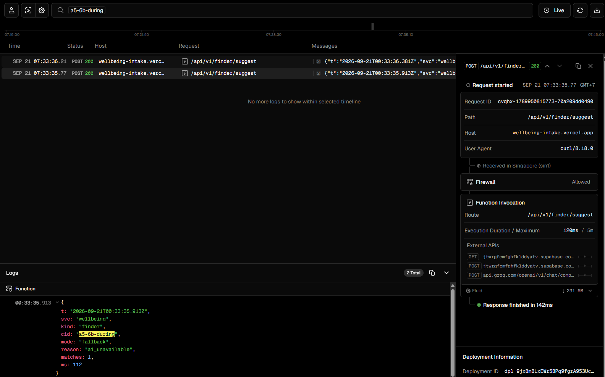
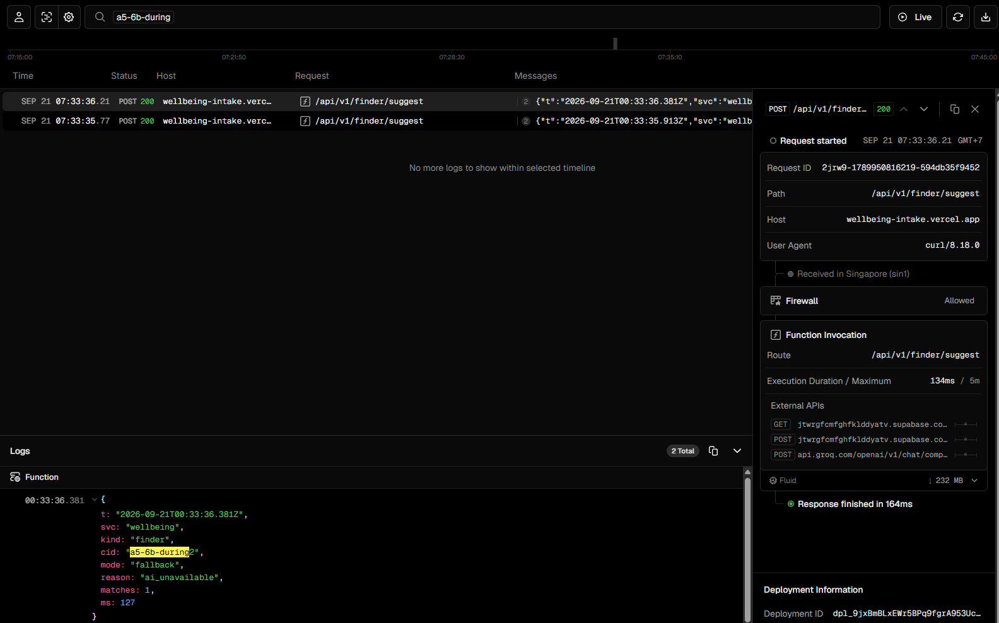
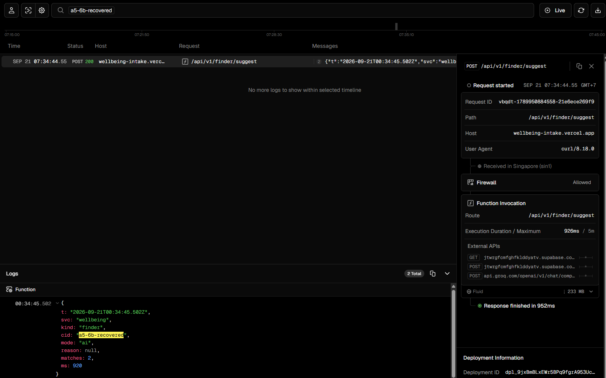

# A5 — Integration Evidence · Team 16 (Private Wellbeing Intake & Booking)

**Team:** 16 — Wellbeing · **Pod:** 4 — Student Support
**Deployed base URL:** `https://wellbeing-intake.vercel.app/api/v1` (Vercel, region `sin1`) · database: Supabase project `jtwrgfcmfghfklddyatv` (`ap-southeast-1`)
**Commit / deploy ID evidenced:** `818596e` for §3–§6a and `73b18dc` for §6b (each reported by `GET /health` as `"version"` at capture time)
**Evidence captured on:** 2026-09-21 05:33–07:35 UTC+7. Timestamps below are ISO-8601 **UTC** (`Z`), exactly as captured; add 7 h for local time.
**Captured by:** Teerapat Sukkasem (6731503015), Team 16

> **Scope of this document.** Team 16 is paired with **one** partner: **Team 14 — Helpdesk**. Team 14
> provides the Provider proof (§2). We are not paired with Team 01 (Identity) or Team 20 (Notification
> Hub), so:
>
> - the webhook proofs (§3, §4, §6a) are real captures from the deployed system, **run by Team 16
>   itself** against our built-in contract mock (`/api/v1/mock/hub`), which verifies the real HMAC
>   signature, platform envelope and `data` allowlist over real HTTP. They prove our side of the
>   contract; they are not a partner's confirmation, and we do not present them as one;
> - the Consumer proof (§1) is out of scope — see §1.
>
> Raw captures: [`docs/evidence/`](evidence).

> Every item below must be a real capture from the deployed system — nothing reconstructed, nothing mocked up after the fact. Anything still marked `TODO` is incomplete.

## Redaction rules (apply to every screenshot and log)

- [ ] Seeded demo users only — no real student record anywhere (platform PRD §6, BR-18).
- [ ] Secrets masked: signing secret, machine credential, service-role key, LLM key, bearer tokens (show first 6 characters at most).
- [ ] No request content (description, free text, preferred times) and no triage level in any capture (NFR-07). Use metadata-only views.
- [ ] Each capture shows its correlation ID (`X-Correlation-Id`) so the log lines and screenshots can be tied together.

## Summary

| # | Proof | Partner team | Our PRD reference | Status |
|---|-------|--------------|-------------------|--------|
| 1 | Consumer | — (not paired with Team 01) | BR-26, FR-03 | **Out of scope** — identity runs in fixture mode |
| 2 | Provider | **Team 14 — Helpdesk** | §11.1 `GET /services`, NFR-18 | TODO — Team 14 runs the one-line `curl` in §2 and sends a screenshot |
| 3 | Webhook receiver | — (self-run) | FR-24 (PRD revision 3), `POST /webhooks/notification-hub` | **Done (self-run)** |
| 4 | Webhook sender | — (contract mock hub) | FR-18, NFR-17, §11.5 | **Done (mock hub)** |
| 5 | Idempotency | — (ours) | K-17 `submission_key`; `eventId` | **Done** — 5a and 5b |
| 6 | Degradation | — (contract mock hub / LLM) | K-18/K-19, FR-23, BR-24 | **Done** — 6a (hub outage) and 6b (LLM rate-limited), both with automatic recovery |

---

## 1. Consumer Proof — we call a partner's API

**Status: out of scope for this submission.** Our designed consumer integration is Team 01 — Student Identity: `src/lib/identity/adapter.ts` verifies a Team 01 access token against their published key set when `IDENTITY_MODE=campus` (BR-26). Team 16 is **not paired with Team 01**, so no real Team 01 token exists to capture, and we will not fabricate one.

What is true of the deployed system instead:

| Field | Value |
|---|---|
| Identity mode deployed | `IDENTITY_MODE=fixture` — seeded demo users via Supabase Auth, which BR-26 permits when Team 01 is unavailable |
| Adapter code | `src/lib/identity/adapter.ts` — the only module that verifies a credential. Switching to `campus` is configuration (`IDENTITY_JWKS_URL`, `IDENTITY_ISSUER`), not a code change (NFR-14) |
| Honest limitation | The `campus` path has never been exercised against a real Team 01 token, and it is not covered by our automated tests. Only fixture mode is proven. |

Our only partner, Team 14 — Helpdesk, exposes no API that this product needs to consume, so we did not invent a call to one for the sake of this section.

---

## 2. Provider Proof — a partner calls our API

**What this proves:** another team successfully consumes a Team 16 endpoint.

Recommended endpoint: `GET /api/v1/services` — public, contains only the seeded service catalogue, so a partner can call it without any privacy exposure. Natural callers: Team 23 (gateway routing + `GET /api/v1/health`), or Team 13 Advising / Team 14 Helpdesk linking students to wellbeing services.

| Field | Value |
|---|---|
| Our endpoint URL | `https://wellbeing-intake.vercel.app/api/v1/services` |
| Calling partner | Team 14 — Helpdesk (`TODO contact name`) |
| Command for the partner | `curl -i https://wellbeing-intake.vercel.app/api/v1/services -H "X-Correlation-Id: team14-a5-0001"` |
| Request timestamp | `TODO` |
| Correlation ID | `TODO` (ask the partner to send one; it must match our log line) |
| HTTP status returned | `TODO` |

**Internal request log** (our side — Vercel function log line showing method, path, status, correlation ID, caller; no bodies):

```
TODO
```

**Partner confirmation** (screenshot of their message, their log, or their UI rendering our data — with their name and the date visible): `TODO `

---

## 3. Webhook Receiver — we receive a partner's event

> **Implemented as FR-24 (PRD revision 3):** `POST /api/v1/webhooks/notification-hub` receives Notification Hub delivery receipts (`notification.delivered` / `notification.failed`) carrying only our opaque `reference`; the signature is verified over the raw body and consumption is idempotent on `eventId`.

| Field | Value |
|---|---|
| Sending partner | **Self-run by Team 16**, signed with our own `HUB_INBOUND_SECRET` (no Notification Hub partner — see Scope) |
| Our receiver URL | `https://wellbeing-intake.vercel.app/api/v1/webhooks/notification-hub` |
| Event type | `notification.delivered` |
| Received at | `2026-09-20T22:33:14.979194Z` (database `received_at`) |
| `eventId` | `26862025-bcd0-4611-b1f2-59ac0e5bd28d` |

**Incoming payload** (exactly as received):

```json
{"eventId":"26862025-bcd0-4611-b1f2-59ac0e5bd28d","type":"notification.delivered","occurredAt":"2026-09-20T22:33:11Z","source":"notification-hub","subject":"reference:demo","data":{"reference":"5545081c-53bb-4e8c-9feb-3e8f9110e804"}}
```

**Secret verification result** — both outcomes:

| Case | Signature header | Result | HTTP status | Correlation ID · response |
|---|---|---|---|---|
| Valid signature | `sha256=c82833…` (masked), `x-signature-timestamp: 1789943591` | verified | `200` | `a5-5b-del1` · `{"received":true,"duplicate":false}` |
| Tampered body — one character changed after signing (`delivered` → `deliverex`), same signature | `sha256=c82833…` (masked) | rejected | `401` | `a5-3-tampered` · `{"error":"invalid_signature"}` |

Vercel log lines: `TODO screenshot — Vercel → Logs → search "a5-5b-del1" and "a5-3-tampered"`

**Stored log** — query output from the deployed database (`inbound_event`, filtered by that `eventId` — exactly one row):

```json
[{"event_id":"26862025-bcd0-4611-b1f2-59ac0e5bd28d","source":"notification-hub","type":"notification.delivered","reference":"5545081c-53bb-4e8c-9feb-3e8f9110e804","received_at":"2026-09-20T22:33:14.979194+00:00"}]
```

---

## 4. Webhook Sender — we send an event to a partner

**What this proves:** FR-18 / NFR-17 — a signed `appointment.reminder` reaches the Notification Hub target in the platform envelope (here: the contract mock hub).

**Internal trigger action:** student books an appointment (`POST /api/v1/appointments`) → reminder reaches its lead time → dispatcher runs (`POST /api/v1/internal/events/dispatch`).

| Step | Timestamp | Correlation ID | Evidence |
|---|---|---|---|
**Receiver in this capture:** our contract mock hub (`HUB_WEBHOOK_URL=https://wellbeing-intake.vercel.app/api/v1/mock/hub`), which checks the HMAC signature, the platform envelope and the `data` allowlist before answering `202`. There is no Notification Hub partner — see Scope.

| Step | Timestamp (UTC) | Correlation ID | Evidence |
|---|---|---|---|
| Booking created | `2026-09-20T22:50:24Z` | `a5-4-booking` | `201` `{"id":"ea92e2d9-0e5f-4457-93c2-fe644f32d41c","startAt":"2026-09-21T07:01:25.449+00:00","status":"confirmed"}` |
| Outbox row inserted (K-18) | same transaction window | — | `event_id 6edcea0e-3b04-4834-9cd8-7d1f4296db13`, `type appointment.reminder`, `reference` = the appointment id |
| Dispatcher delivered (inline, right after booking) | `2026-09-20T22:50:28.532846Z` | `a5-4-booking` | `attempts 1`, `last_status 202`; Vercel log line `TODO screenshot — search "a5-4-booking"` |

**Outgoing payload** — `data` has exactly 3 fields; no service, practitioner, reason or triage level. The delivered row is nulled (K-19), so this is the `data` block of the identically-built reminder in §6a, read from the outbox while it was still pending:

```json
{ "message": "You have an appointment.", "reference": "fcbe8a2f-0847-4ac3-8a67-1a6f97d825c1", "appointmentAt": "2026-09-21T08:01:25Z" }
```

with `subject` `student:3d77124f-5e2c-4c35-b7da-b8e74d1d0d06` (the recipient's opaque identity reference, a seeded demo user).

Signature header sent: `X-Signature: sha256=<hex>` with `X-Signature-Timestamp` — the mock hub recomputed the HMAC over `"<timestamp>.<raw body>"` and accepted it (`202`). The header value itself is not logged by design, so it is not reproduced here.

**Partner response log:** HTTP status `202` from the mock hub (it answers `401` on a bad signature, `400` on a bad envelope, `422` on `data` outside the contract).

**After delivery** — outbox row, `delivered_at` set and `subject` / `payload` nulled (K-19):

```json
[{"event_id":"6edcea0e-3b04-4834-9cd8-7d1f4296db13","type":"appointment.reminder","reference":"ea92e2d9-0e5f-4457-93c2-fe644f32d41c","attempts":1,"last_status":202,"next_attempt_at":"2026-09-20T22:50:49.470929+00:00","delivered_at":"2026-09-20T22:50:28.532846+00:00","failed_at":null,"subject":null,"payload":null}]
```

---

## 5. Idempotency Proof — same request twice, one record

Two candidates; submit at least one, ideally both.

### 5a. `POST /api/v1/requests` with the same `submission_key` (K-17)

| | Req 1 | Req 2 (replay) |
|---|---|---|
| Timestamp (UTC) | `2026-09-20T22:33:09Z` | `2026-09-20T22:33:10Z` |
| Correlation ID | `a5-5a-req1` | `a5-5a-req2` |
| `submission_key` | `19267117-022d-4128-a196-1348548429b3` | same |
| HTTP status | `201 Created` | `200 OK` — returns the existing request |
| Returned request id | `a9e01cc4-fac0-4851-9336-3007f9d0380d` | **same id** |
| `created` flag | `true` | `false` |

Payload — byte-identical for both requests (obviously fake description, as required):

```json
{"serviceId":"689dfeea-2a43-4aa9-87b4-55cfacaf29bc","structuredDescription":"demo-sentinel-A5","preferredTimes":"any","triageLevelId":1,"submissionKey":"19267117-022d-4128-a196-1348548429b3"}
```

Response 1:

```json
{"id":"a9e01cc4-fac0-4851-9336-3007f9d0380d","status":"submitted","triageLevelId":1,"submittedAt":"2026-09-20T22:33:13.184206+00:00","created":true,"acute":false}
```

Response 2 — same `id`, same `submittedAt`, `created:false`:

```json
{"id":"a9e01cc4-fac0-4851-9336-3007f9d0380d","status":"submitted","triageLevelId":1,"submittedAt":"2026-09-20T22:33:13.184206+00:00","created":false,"acute":false}
```

**DB proof of single creation:**

```sql
select count(*) from request where submission_key = '19267117-022d-4128-a196-1348548429b3';
-- expected: 1
```

Result from the deployed database (exact count via the REST API, `Prefer: count=exact`): `Content-Range: 0-0/1` → **1 row**.
`TODO optional screenshot — run the SQL above in Supabase → SQL Editor`

### 5b. Inbound webhook delivered twice with the same `eventId` (from §3)

| | Delivery 1 | Delivery 2 (duplicate) |
|---|---|---|
| Timestamp (UTC) | `2026-09-20T22:33:11Z` | `2026-09-20T22:33:11Z` |
| Correlation ID | `a5-5b-del1` | `a5-5b-del2` |
| `eventId` | `26862025-bcd0-4611-b1f2-59ac0e5bd28d` | same (same body, same signature) |
| HTTP status | `200` | `200` — acknowledged, not reprocessed |
| Response | `{"received":true,"duplicate":false}` | `{"received":true,"duplicate":true}` |

DB proof — one stored row for that `eventId` (the primary key on `inbound_event.event_id` makes a second insert impossible):

```json
[{"event_id":"26862025-bcd0-4611-b1f2-59ac0e5bd28d","source":"notification-hub","type":"notification.delivered","reference":"5545081c-53bb-4e8c-9feb-3e8f9110e804","received_at":"2026-09-20T22:33:14.979194+00:00"}]
```

---

## 6. Degradation Proof — a dependency breaks, we keep working, we recover automatically

### 6a. Notification Hub unreachable (primary — partner dependency)

**How it was broken:** the hub target was switched into outage mode — `PUT /api/v1/mock/hub {"fail":true}` with the machine credential — so every delivery received `503 {"error":"mock_hub_outage"}` over real HTTP.

One event throughout: `event_id 7639a8f8-ba9a-426a-b960-ab9be25715b0`.

| Moment | Timestamp (UTC) | Evidence |
|---|---|---|
| Breakage | `2026-09-20T22:51:05Z` | cid `a5-6a-break` → `200 {"fail":true}` |
| Booking during outage still succeeds | `2026-09-20T22:51:06Z` | cid `a5-6a-booking` → **`201`**, fallback JSON below |
| Attempt 1 fails (inline) | `22:51:06Z` | outbox: `attempts 1`, `last_status 503`, `next_attempt_at 22:51:39Z` (**≈ 30 s later**), `delivered_at null` |
| Attempt 2 fails (dispatcher) | `2026-09-20T22:51:49Z` | cid `a5-6a-retry2` → `{"enqueued":0,"claimed":1,"delivered":0,"retrying":1,"parked":0}`; outbox: `attempts 2`, `last_status 503`, `next_attempt_at 22:53:03Z` (**≈ 70 s later** — interval growing, same `event_id`) |
| Dependency restored | `2026-09-20T22:52:17Z` | cid `a5-6a-restore` → `{"fail":false}` |
| Automatic recovery | `2026-09-20T22:53:07Z` | cid `a5-6a-recover` → `{"enqueued":0,"claimed":1,"delivered":1,"retrying":0,"parked":0}`; outbox: `attempts 3`, `last_status 202`, `delivered_at 22:53:21Z`, `subject` and `payload` nulled |

**What "automatic" means here:** no row was edited and nothing was re-queued by hand. Recovery was the ordinary dispatcher call picking up the row when its `next_attempt_at` came due. In production that call is made by the scheduled GitHub Actions workflow (`dispatch.yml`, every 3 hours); for this capture we invoked the same endpoint at the due times instead of waiting for the schedule.

Pending outbox row during the outage (it still holds its payload — exactly the three allowed fields):

```json
[{"event_id":"7639a8f8-ba9a-426a-b960-ab9be25715b0","type":"appointment.reminder","attempts":1,"last_status":503,"next_attempt_at":"2026-09-20T22:51:39.850353+00:00","delivered_at":null,"failed_at":null,"subject":"student:3d77124f-5e2c-4c35-b7da-b8e74d1d0d06","payload":{"message": "You have an appointment.", "reference": "fcbe8a2f-0847-4ac3-8a67-1a6f97d825c1", "appointmentAt": "2026-09-21T08:01:25Z"}}]
```

The same row after recovery:

```json
[{"event_id":"7639a8f8-ba9a-426a-b960-ab9be25715b0","attempts":3,"last_status":202,"delivered_at":"2026-09-20T22:53:21.05775+00:00","failed_at":null,"subject":null,"payload":null}]
```

The appointment was never affected by the outage:

```json
[{"id":"fcbe8a2f-0847-4ac3-8a67-1a6f97d825c1","status":"confirmed","reminder_published_at":"2026-09-20T22:51:09.759946+00:00"}]
```

**Fallback JSON output** (the booking response returned to the student while the Hub was down — identical in shape to a normal booking; the student is never told, and never blocked, by a notification outage):

```json
{"id":"fcbe8a2f-0847-4ac3-8a67-1a6f97d825c1","startAt":"2026-09-21T08:01:25.449+00:00","status":"confirmed"}
```

### 6b. LLM unavailable (AI capability with deterministic fallback — FR-23, BR-24)

**Dependency:** Groq (`openai/gpt-oss-20b`), the LLM behind the "help me choose" helper. Deploy evidenced here: `73b18dc`.

**How it was broken:** Groq's free tier allows 8,000 tokens per minute. We used that allowance up with one oversized request sent **from outside the app** with the same API key, so Groq answered every further request — including our deployed app's — with `429 rate_limit_exceeded` (`retry-after: 55`). This is a real provider-side failure, not a flag flipped in our own code.

| Moment | Timestamp (UTC) | Evidence |
|---|---|---|
| Before — AI healthy | `2026-09-21T00:33:29Z` | cid `a5-6b-before` → `200`, `mode:"ai"`, two services ranked |
| Breakage | `2026-09-21T00:33:30Z` | burn request 1 → `200`, 156 tokens left; burn request 2 → **`429 rate_limit_exceeded`**, `retry-after: 55` |
| During — helper still answers | `2026-09-21T00:33:32Z` | cid `a5-6b-during` and `a5-6b-during2` → **`200`**, `mode:"fallback"` (below) |
| Automatic recovery | `2026-09-21T00:34:41Z` | cid `a5-6b-recovered` → `200`, `mode:"ai"` again — 69 s later, when Groq's window reset. No redeploy, no configuration change, no action by anyone. |

**Server-side log lines** (Vercel → Logs, production deployment `dpl_9jxBmBLxEWr5BPq9fgrA953Uc…`, region `sin1`). Each screenshot shows our own structured log line and, in Vercel's *External APIs* panel, the outbound `POST api.groq.com/openai/v1/chat/completions` made by that request:

| cid | Server time (UTC) | `mode` | `reason` | `ms` |
|---|---|---|---|---|
| `a5-6b-during` | `2026-09-21T00:33:35.913Z` | `fallback` | `ai_unavailable` | 112 — Groq refused at once |
| `a5-6b-during2` | `2026-09-21T00:33:36.381Z` | `fallback` | `ai_unavailable` | 127 |
| `a5-6b-recovered` | `2026-09-21T00:34:45.502Z` | `ai` | `null` | 920 — a real model answer |

The log lines carry mode, reason, match count and latency only — never the typed text (NFR-07, NFR-10). Server times are about 4 s later than the client timestamps in the table above: the capturing PC's clock runs slightly behind.







Request body in every call: `{"text":"trouble sleeping before exams"}`.

**Fallback JSON output** during the outage — a ranked list of seeded service IDs from the deterministic keyword matcher; the visitor gets an answer, not an error:

```json
{"mode":"fallback","serviceIds":["6c940476-f362-4090-b96a-40d75ed2564b"]}
```

Same call after recovery — the model ranks a second relevant service the keyword matcher did not find:

```json
{"mode":"ai","serviceIds":["6c940476-f362-4090-b96a-40d75ed2564b","689dfeea-2a43-4aa9-87b4-55cfacaf29bc"]}
```

In both modes the response carries **only seeded service IDs** — model-written text never reaches a screen (BR-24).

**Also captured earlier** (`2026-09-20T23:09:24Z`, cid `a5-6b-fallback`, deploy `818596e`): with the capability switched off entirely (`AI_FINDER_ENABLED=false`, no key) the same call returned the same `mode:"fallback"` answer.

**Automated coverage of the fallback triggers:** `tests/unit/finder-ai.test.ts` stubs the network and asserts a fallback on HTTP 500, HTTP 429, a timeout, a network failure, free text instead of JSON, JSON of the wrong shape, an id outside the catalogue, and more than three ids; `tests/integration/platform.test.ts` covers AI switched off, no key, and daily budget exhausted. All green in CI.

---

## Sign-off

| Partner team | Contact | What they confirmed | Date |
|---|---|---|---|
| Team 14 — Helpdesk | `TODO` | §2 | `TODO` |

---

## Appendix — how to capture each proof with this codebase

Set once (Git Bash). Use the deployed URL for the real submission; `http://localhost:3000` for a dry run.

```bash
HOST=https://wellbeing-intake.vercel.app
CID=a5-$(date +%Y%m%dT%H%M%S)            # one correlation id per proof ties screenshots to log lines
login() { curl -s -X POST $HOST/api/v1/session -H 'content-type: application/json' -H "origin: $HOST" \
  -d "{\"email\":\"$1\",\"password\":\"demo-password-16\"}" | node -pe 'JSON.parse(require("fs").readFileSync(0)).accessToken'; }
STUDENT=$(login student.a@demo.test); COUNSELLOR=$(login counsellor.1@demo.test)
```

Server log lines are single-line JSON containing `"cid":"<your CID>"` — in Vercel: Project → Logs → search the CID.

**1 · Consumer (Team 01).** Set `IDENTITY_MODE=campus`, `IDENTITY_JWKS_URL`, `IDENTITY_ISSUER`. Obtain a token from Team 01, then
`curl -i $HOST/api/v1/me -H "Authorization: Bearer $TEAM01_TOKEN" -H "X-Correlation-Id: $CID"`.
A `200` with your role proves the adapter fetched Team 01's key set and verified the token. Screenshot the response and the
partner URL (`IDENTITY_JWKS_URL`) being fetched; repeat with a tampered token to show `401`.

**2 · Provider.** Ask the partner to run (and screenshot)
`curl -i $HOST/api/v1/services -H "X-Correlation-Id: team13-a5-0001"`. Your internal log is the line with that `cid`.

**3 · Webhook receiver.** Partner (or a dry run with their secret) POSTs a signed receipt:

```bash
BODY='{"eventId":"'$(node -p 'crypto.randomUUID()')'","type":"notification.delivered","occurredAt":"'$(date -u +%Y-%m-%dT%H:%M:%SZ)'","source":"notification-hub","subject":"reference:demo","data":{"reference":"'$(node -p 'crypto.randomUUID()')'"}}'
TS=$(date +%s)
SIG=sha256=$(printf '%s.%s' "$TS" "$BODY" | openssl dgst -sha256 -hmac "$HUB_INBOUND_SECRET" | awk '{print $NF}')
curl -i -X POST $HOST/api/v1/webhooks/notification-hub -H 'content-type: application/json' \
  -H "x-signature: $SIG" -H "x-signature-timestamp: $TS" -H "X-Correlation-Id: $CID" -d "$BODY"
```

Valid → `200 {"received":true,"duplicate":false}` and log `"signature":"verified"`. Change one character of `$BODY` after signing →
`401` and log `"signature":"rejected","reason":"mismatch"`. Stored log: `select * from inbound_event order by received_at desc limit 5;`

**4 · Webhook sender.** Book a slot that starts within 24 h (the seed creates one per practitioner ~20 h ahead): submit a request as
the student, open it as the counsellor, book it as the student (UI or API). The booking triggers an inline dispatch. Evidence:
the `kind:"webhook"` log line (`eventId`, `attempt`, `status`, `outcome:"delivered"`), the payload as Team 20 received it, their
confirmation, and `select event_id,type,attempts,last_status,delivered_at,subject,payload from outbound_event order by occurred_at desc limit 3;`
(subject and payload are `null` after delivery — K-19). To show the payload *before* delivery, unset `HUB_WEBHOOK_URL`, book, query the row, then restore the URL and run the dispatcher.

**5 · Idempotency.** 5a: send the *same* body twice —

```bash
KEY=$(node -p 'crypto.randomUUID()'); SVC=$(curl -s $HOST/api/v1/services | node -pe 'JSON.parse(require("fs").readFileSync(0)).services[0].id')
REQ='{"serviceId":"'$SVC'","structuredDescription":"demo-sentinel-A5","preferredTimes":"any","triageLevelId":1,"submissionKey":"'$KEY'"}'
curl -i -X POST $HOST/api/v1/requests -H "Authorization: Bearer $STUDENT" -H 'content-type: application/json' -d "$REQ"   # 201 created:true
curl -i -X POST $HOST/api/v1/requests -H "Authorization: Bearer $STUDENT" -H 'content-type: application/json' -d "$REQ"   # 200 created:false, same id
```

DB proof: `select count(*) from request where submission_key = '<KEY>';` → `1`. 5b: run the proof-3 curl twice with the same `$BODY` →
second response `"duplicate":true`; `select count(*) from inbound_event where event_id = '<eventId>';` → `1`.

**6 · Degradation.** 6a (Hub down): `curl -X PUT $HOST/api/v1/mock/hub -H "Authorization: Bearer $DISPATCH_TOKEN" -H 'content-type: application/json' -d '{"fail":true}'`
(or have Team 20 take their endpoint down at an agreed time) → book a near-term slot: the booking still returns `201` (the fallback JSON) →
logs show `outcome:"retry_scheduled"` with a growing `nextAttemptAt`, same `eventId` → restore with `{"fail":false}` → the next scheduled
dispatch (or `POST /internal/events/dispatch`) logs `outcome:"delivered"` with no manual data fix: that is the automatic-recovery log.
6b (LLM down): with `AI_FINDER_ENABLED=true`, break `LLM_API_KEY` →
`curl -s -X POST $HOST/api/v1/finder/suggest -H 'content-type: application/json' -d '{"text":"trouble sleeping"}'` → `{"mode":"fallback",...}`;
restore the key → `{"mode":"ai",...}`. The `kind:"finder"` log lines give the breakage and recovery timestamps.
